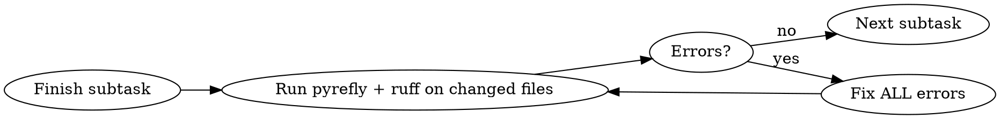

# Python Development

## Overview

All Python code must be strictly typed, style-checked, and managed through `uv`. No suppression comments allowed. Fix problems at the source.

## When to Use

- Editing or creating any `.py` file
- Adding Python dependencies
- Running Python scripts or tests
- Setting up a new Python project
- Reviewing Python code

## Package Management: uv Only

| Action | Command |
|--------|---------|
| Init new project | `uv init` |
| Install dependency | `uv add <package>` |
| Install dev dependency | `uv add --dev <package>` |
| Remove dependency | `uv remove <package>` |
| Run Python script | `uv run python script.py` |
| Run tests | `uv run pytest` |
| Run any tool | `uv run <tool>` |

**Forbidden:**
- `pip install`, `pip3 install`, `python -m pip`
- Bare `python` or `python3` -- always `uv run python`
- `poetry`, `pipenv`, `conda`
- Manually editing `requirements.txt`

## Typing: Every Function, Every Time

- Every parameter must have a type annotation
- Every function must have a return type (including `-> None`)
- Use modern syntax: `list[str]` not `List[str]`, `dict[str, int]` not `Dict[str, int]`
- Use `X | None` not `Optional[X]`
- No `Any` unless unavoidable (comment why)
- Use specific generic parameters: `dict[str, int]` not bare `dict`, `list[str]` not bare `list`

```python
# CORRECT
def process_items(items: list[str], limit: int = 10) -> dict[str, int]:
    ...

# WRONG
def process_items(items, limit=10):
    ...
```

## Data Modeling: Pydantic for Structured Data

Use `pydantic.BaseModel` for all structured data: configs, API models, DTOs, data classes.

```python
# CORRECT
from pydantic import BaseModel, Field

class UserConfig(BaseModel):
    name: str
    max_retries: int = Field(default=3, ge=1)
    tags: list[str] = Field(default_factory=list)

# WRONG - don't use dataclass or TypedDict for structured data
@dataclass
class UserConfig:
    name: str
    max_retries: int = 3
```

**Don't use:** `dataclasses.dataclass`, `TypedDict`, or raw dicts for structured data.
**Exception:** Simple return values (tuples, primitives) don't need Pydantic.

## Verification: After Every Subtask

After completing each logical unit of work (function, class, module, test file), run checkers only on the files you changed in that subtask:

```bash
uv run pyrefly check <changed paths>    # Type checking
uv run ruff check <changed paths>       # Style checking
```



**Rules:**
- Never proceed with unresolved errors in changed files
- Fix errors immediately, not later
- Re-run checks after fixes until clean
- Do not expand checker scope beyond changed files during subtask verification

## No Suppressions -- Zero Tolerance

**Never write any of these:**
- `# noqa`
- `# type: ignore`
- `# pyright: ignore`
- `# pyrefly: ignore`
- Any checker suppression comment

**Never modify checker configs to dodge errors:**
- Don't add rules to ruff `ignore` lists
- Don't add files to ruff `exclude`
- Don't add entries to pyrefly ignore configs

If a checker flags it, the code is wrong. Fix the code.

## Rationalization Table

| Excuse | Reality |
|--------|---------|
| "Just this once with `noqa`" | One suppression becomes many. Fix the code. |
| "pyrefly is wrong here" | Investigate deeper. The type is usually wrong. |
| "I'll add types later" | Types are part of implementation, not afterthought. |
| "This dict is simpler than Pydantic" | Pydantic catches bugs at construction time. Use it. |
| "Dataclass is fine for a prototype" | Prototypes become production. Pydantic from the start. |
| "It's just a demo / prototype" | Demos get shipped. Standards apply always. No exceptions for scope. |
| "pip install is faster" | uv is faster than pip. Use `uv add`. |
| "I'll run checks at the end" | Errors compound. Check after each subtask. Not at the end. |
| "This is just a quick script" | Quick scripts become production code. Type it. |
| "`Any` is fine here" | Spend 2 minutes finding the real type. |
| "Bare `dict` return is fine" | Use specific generics: `dict[str, int]` not `dict`. |
| "The checker is a false positive" | Investigate first. It's almost never a false positive. |

## Red Flags -- STOP If You Catch Yourself

- About to write `# noqa` or `# type: ignore`
- Writing a function without type annotations
- Using `pip install` or bare `python`
- Creating a `dataclass` or `TypedDict` for structured data
- Skipping checker run after finishing a subtask
- Telling yourself "I'll run checks at the end, it's faster"
- Adding rules to checker ignore lists
- Thinking "it's just a prototype/demo" justifies lower standards

**All of these mean: STOP, go back, do it correctly.**
